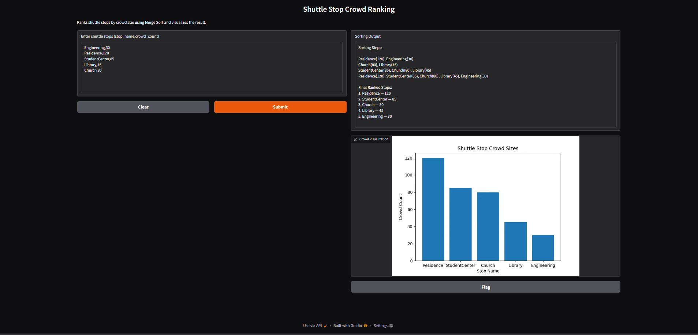
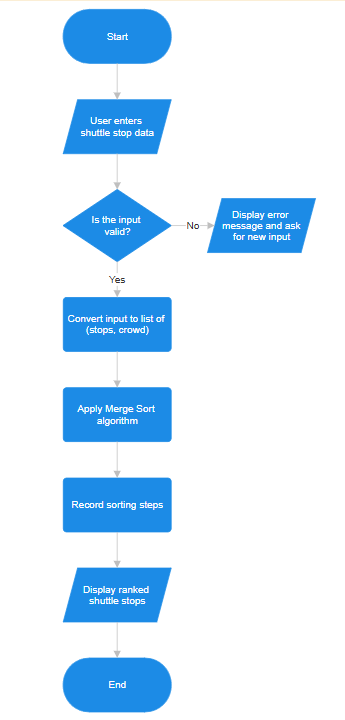

CISC Project Merge Sort Shuttle Stop Crowd Ranking

**Chosen Problem:** (3) Shuttle Stop Crowd Ranking

Sort shuttle stops by crowd size to determine where to send additional shuttles.

**Chosen Algorithm:** Merge Sort

Merge Sort was selected because it efficiently sorts datasets in O(n log n) time and clearly demonstrates the divide-and-conquer approach.

**Demo**

**Computational Thinking**

**Decomposition**

The problem is broken into smaller steps:

\- The user enters shuttle stop data in the format stop\_name, crowd\_count.

\- The program parses the input and converts it into a list of records.

\- The Merge Sort algorithm divides the list into smaller sublists.

\- Each sublist is sorted and merged back together in order.

\- The program records each merge step to visualize the algorithm.

\- The sorted list is displayed to the user as a ranked list of shuttle stops.

**Pattern Recognition**

Merge Sort repeatedly performs the same operations:

\- Dividing the dataset into smaller halves.

\- Comparing crowd counts between two elements.

\- Merging elements back into a sorted order.

These repeated comparisons and merges form the core pattern of the algorithm.

**Abstraction**

To keep the visualization simple:

Shown to the user:

\- The shuttle stop names

\- The crowd counts

\- The order of stops changing during sorting

Hidden from the user:

\- Internal recursion calls

\- Temporary variables used in the algorithm

\- Low-level Python implementation details

This allows the user to focus on how the ranking changes as the algorithm sorts the data.

**Algorithm Design**

Input: User enters shuttle stop data as text.

Process: The program converts the input into a list of (stop\_name, crowd\_count) pairs and applies the Merge Sort algorithm to sort them by crowd size.

Output: The program displays the step-by-step sorting process and the final ranked list of shuttle stops from highest to lowest crowd count.

**Flowchart**

**Steps to Run**

pip install -r requirements.txt

python app.py

**Hugging Face Link**

https://huggingface.co/spaces/Wavey74/CISC121-merge-sort-visualization

**Testing**

Edge cases tested:

\- empty input

\- invalid input

\- single stop

\- already sorted data

\- reverse order data

**Author**

Ethan Li

